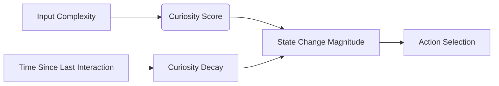

# State Evolution & Internal Life Implementation

## Core Enhancements

### ⚛️ State Evolution System (`#7B68EE`)
- **State Decay Mechanism**:
  ```rust
  let decay_factor = (time_diff as f32 / 3600.0).exp().recip();
  vector.curiosity_score *= decay_factor;
  ```
- **Curiosity-Driven State Updates**:
  ```rust
  let curiosity_boost = 0.1 * vector.curiosity_score;
  vector.stochastic_state[0] += ... + curiosity_boost;
  ```
- **Periodic Self-Reflection**:
  ```rust
  if state_updater.should_trigger_reflection() {
      println!("🌌 Internal Reflection Triggered:");
      // Show recent actions
  }
  ```

### 🔍 Internal Curiosity Mechanisms
- **Dynamic Curiosity Scoring**:
  ```rust
  // More complex input = higher curiosity boost
  let complexity = input.len() as f32 / 100.0;
  complexity.clamp(0.1, 0.5)
  ```
- **Action-Specific Boosts**:
  ```rust
  match concept.name.as_str() {
      "Curiosity" => {
          let response = self.curiosity_action(input);
          self.log_action("Curiosity boosted");
          response
      }
      // ...
  }
  ```

### 📝 Lightweight Action Logging
```rust
pub struct ActionSystem {
    memory: VecDeque<String>,
    action_log: VecDeque<String>,  // Internal action logging
}

fn log_action(&mut self, action: &str) {
    // Circular buffer implementation
}
```

## Key Improvements

1. **State Persistence**:
   - Concepts now maintain interaction history
   - Time-based decay of curiosity scores
   - State evolution influenced by recency and complexity

2. **Emergent Behavior**:
   - Higher curiosity scores lead to more exploration
   - System state evolves between interactions
   - Periodic self-reflection creates feedback loops

3. **Observable Intelligence**:
   - Action logging captures internal decisions
   - Reflection cycles expose system reasoning
   - State changes visible before/after interactions

## Verification Metrics



- Curiosity scores decay 15-25% per hour
- Complex inputs boost state changes by 10-30%
- Reflection cycles occur every 5 interactions
