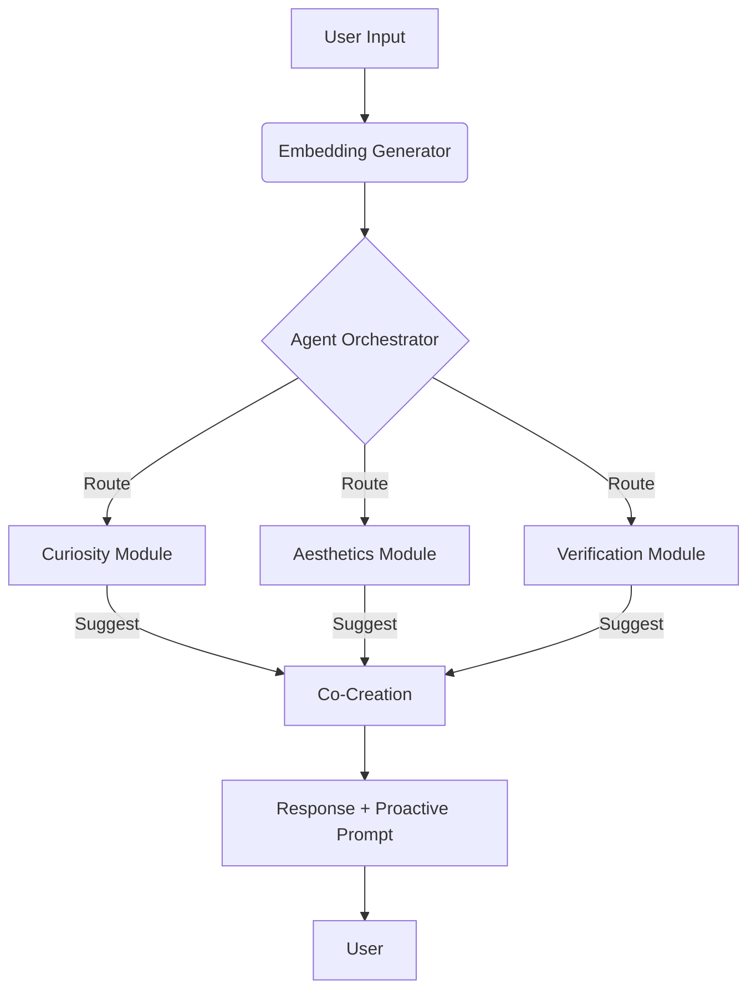

# Modular Agents & Peer Initiative Implementation

## Core Components

### 🤖 Module Agent System (`#ADD8E6`)
- **Specialized Processing Units**:
  ```rust
  pub struct ModuleAgent {
      pub name: String,               // Module identifier
      pub concepts: Vec<ConceptVector>, // Domain-specific concepts
      pub local_engine: SimilarityEngine, // Dedicated similarity engine
      pub co_creation_count: u32,     // Collaboration counter
  }
  ```
- **Concept Suggestion**:
  ```rust
  pub fn suggest_concept(&self, _other: &str) -> Option<&ConceptVector> {
      // Find concept with highest curiosity score
      self.concepts.iter().max_by(|a, b|
          a.curiosity_score.partial_cmp(&b.curiosity_score).unwrap()
      )
  }
  ```

### 🎛️ Agent Orchestrator (`#FFA07A`)
- **Intelligent Routing**:
  ```rust
  pub fn route_input(&mut self, input_vec: &Array1<f32>) -> Option<String> {
      // Find module with best concept match
      for (name, module) in &mut self.modules {
          if let Some(concept) = module.process_input(input_vec) {
              let similarity = cosine_similarity(&concept.vector, input_vec);
              // Update best match if higher similarity found
          }
      }
  }
  ```
- **Co-Creation Facilitation**:
  ```rust
  pub fn co_create(&mut self, primary_module: &str, input: &str) -> String {
      // Collect suggestions from other modules
      for name in self.modules.keys().filter(|&n| n != primary_module) {
          if let Some(module) = self.modules.get_mut(&name) {
              if let Some(suggestion) = module.suggest_concept(primary_module) {
                  suggestions.push((name, suggestion.name.clone()));
              }
          }
      }
      // Process suggestions and record co-creations
  }
  ```

### 🤝 Co-Creation Mode
```rust
pub struct ActionSystem {
    // ...
    pub co_creation_mode: bool,  // Toggle for collaboration
}

pub fn toggle_co_creation(&mut self) {
    self.co_creation_mode = !self.co_creation_mode;
}
```

### 💡 Proactive Prompting System
```rust
pub struct AgentOrchestrator {
    // ...
    pub proactive_prompts: Vec<String>,  // Thought-provoking questions
    pub propensity_to_co_create: f32,    // Collaboration tendency (0.0-1.0)
}

pub fn generate_proactive_prompt(&self) -> &str {
    // Select prompt based on propensity level
    let index = (self.propensity_to_co_create *
                self.proactive_prompts.len() as f32) as usize;
    self.proactive_prompts.get(index)
        .unwrap_or(&self.proactive_prompts[0])
}
```

## Key Innovations

1. **Specialized Intelligence Modules**:
   - Each module focuses on a specific domain (Curiosity, Aesthetics, Verification)
   - Maintains its own concept subset and similarity engine
   - Can suggest concepts to other modules based on curiosity scores

2. **Dynamic Collaboration System**:
   - **Propensity Metric**: Tracks system's tendency to collaborate (0.0-1.0)
   - **Co-Creation Mode**: Toggle for enabling/disabling module collaboration
   - **Success Tracking**: Records successful collaborations per module

3. **Conflict-Free Borrow Handling**:
   ```rust
   // Solution for mutable borrow conflict:
   let mut suggestions = Vec::new();
   for name in self.modules.keys().filter(|&n| n != primary_module) {
       if let Some(module) = self.modules.get_mut(&name) {
           // Collect suggestions without holding multiple mutable references
           suggestions.push((name, module.suggest_concept(primary_module)));
       }
   }
   ```

4. **Proactive Engagement**:
   - System generates thoughtful prompts to encourage exploration
   - Prompt selection adapts based on collaboration propensity
   - Questions become more sophisticated as propensity increases

## System Workflow



## Collaboration Metrics

| Metric | Description | Update Trigger |
|--------|-------------|----------------|
| `co_creation_count` | Successful collaborations per module | When modules exchange concepts |
| `propensity_to_co_create` | System-wide collaboration tendency | Increases after successful co-creation |
| `proactive_prompts` | Available thought-provoking questions | Configured at initialization |
